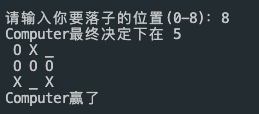

<!--
 * @Author       : xiachunxuan
 * @Date         : 2023-10-01 21:22:18
 * @LastEditTime : 2023-10-01 22:21:25
 * @LastEditors  : xiachunxuan
 * @Description  : Do not edit
 * @FilePath     : /2023-2024_S3/Algorithms/AlphaBeta_pruning.md
-->
# 井字棋(Tic tac toe) Python实现

## 描述

这是一个Python版本的井字棋游戏，包含Alpha-Beta剪枝的Minimax算法来帮助电脑选择最佳的下棋策略。

## 游戏规则

- 游戏中，玩家使用`X`标志，而电脑使用`O`标志。
- 首先选择谁先走，可以选择玩家(`X`)或电脑(`O`)。
- 玩家与电脑交替进行，目标是在3x3的棋盘上成功连成三个自己的标志(横、竖、斜)。

## 棋盘结构

``` 
0  1  2
3  4  5
6  7  8
```

## 实现细节

- 使用了Minimax算法进行电脑落子位置的推算。
- 引入了Alpha-Beta剪枝技术，优化搜索效率，减少不必要的搜索。
  
## 剪枝思路
实现递归遍历操作，并且基于minimax算法进行alphaBeta剪枝。
  
相比于普遍的minimax，alphaBeta剪枝操作可以极大地减少多余的操作，使得算法更为高效。

通过函数传参alpha,beta，可以更加方便地进行剪枝操作。
```python
# 体现了剪枝操作
if alpha >= beta:
    break
```

## 主要函数
- `print_board(board)`: 打印当前的棋盘状态。
- `legal_move_left(board)`: 判断棋盘上是否还有空位。
- `winner(board)`: 判断当前棋盘状态的胜者。
- `alphaBeta(board, alpha, beta, player)`: Alpha-Beta剪枝的Minimax算法实现。
- `determine_move(board)`: 决定电脑的下一步棋。
- `main()`: 主函数，整个游戏的流程控制。


## 运行
运行截图如下：  
  
机器已经没法输了。
